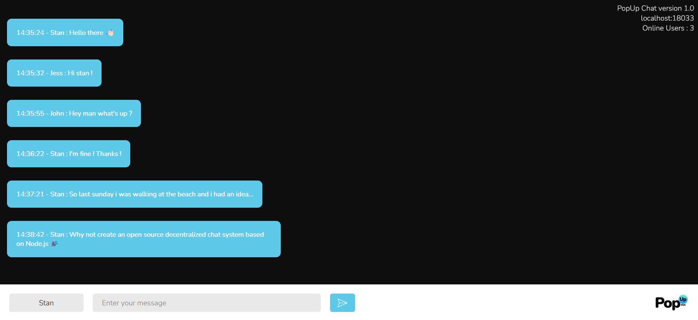
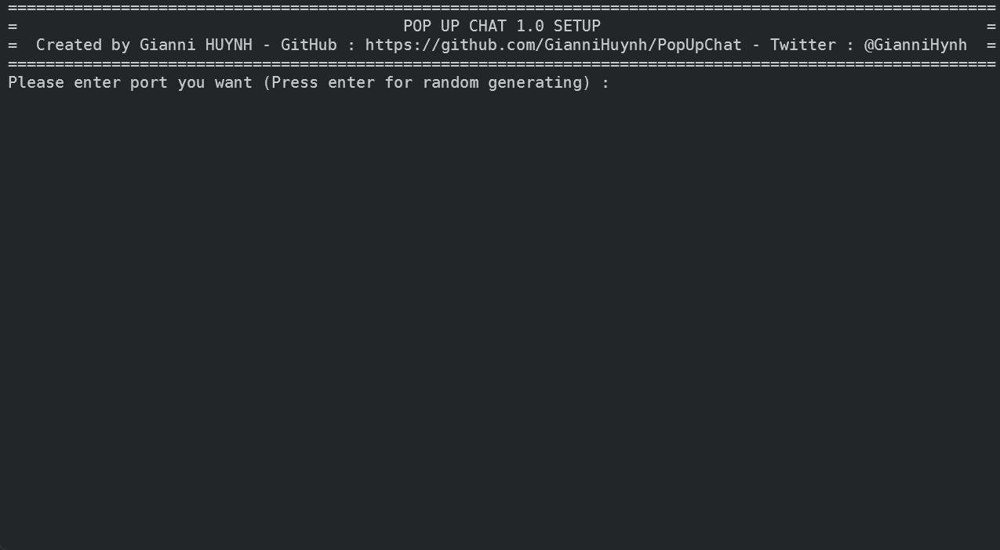
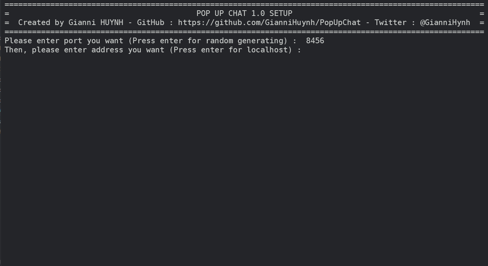
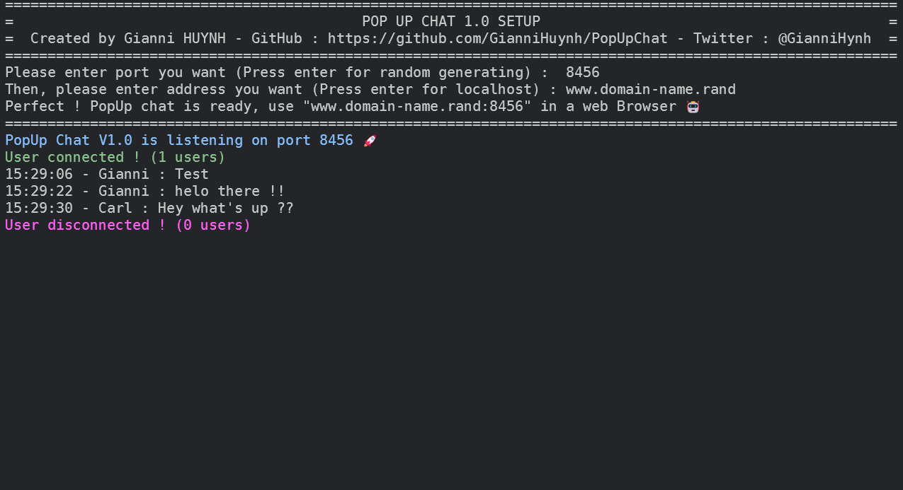
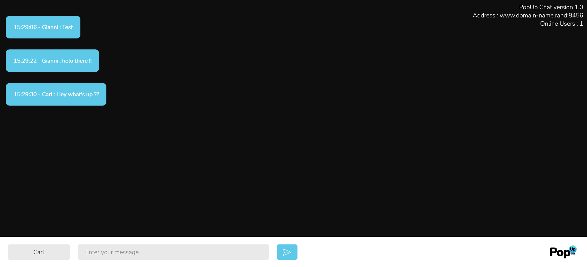

# PopUpChat 1.0


<h2>What is it ?</h2>

PopUp chat is an Open-Source decentralized solution for chatting based on Node.js.
The goal of this project is to propose a light solution, secure, easy and quick to deploy on any computer.
<br/>
<br/>
You can try PopUp Chat on the <a href = "http://129.151.244.35:9500">demo website</a>


<h2>How it's works ?</h2>
PopUp chat is a decentralized chat, so that's means that you need to download and deploy PopUpChat on your own machine/server.
When PopUpChat server is deployed, you can connect to it with a web browser, by this process, YOU AND ONLY YOU can see and control the data on your PopUp Chat version, NO DATA is collected on our servers.
<h2>How to deploy PopUp Chat ?</h2>
PopUp server can be deployed on Windows, Linux and macOS, but in all these cases you must have Node.js on your machine.
<br/>
<br/>
<h3>Windows and macOS :</h3>
- First install Node.js if you didn't have it (https://nodejs.org)
- Then, clone this repository on your machine :
```shell
$ git clone https://github.com/GianniHuynh/PopUpChat
```
- Move into PopUp Chat directory and launch PopUp chat with the following command :
```shell
$ node index.js
```
<br/>

<h3>Linux :</h3>
- First install Node.js and npm if you didn't have it :
```shell
# Debian/Ubuntu
$ sudo apt install nodejs npm
# Fedora/Red-Hat/Cent OS
$ sudo dnf module install nodejs:12
# Arch Linux/Manjaro Linux
$ sudo pacman -S nodejs npm
```
- Then, clone this repository on your machine :
```
$ git clone https://github.com/GianniHuynh/PopUpChat
```
- Move into PopUp Chat directory and launch PopUp chat with the following command :
```shell
$ node index.js
```

<h3>PopUp Chat setup</h3>
- First, enter the port you want for your server, or just press enter to let PopUp chat generate a random port number :

<br/>
<br/>
- Then, enter the IP address or domain name of the server or just press enter for "localhost" :

<br/>
<br/>
- After that, the server will start, congratulations ! You have deployed PopUp Chat 🎉

<br/>
<br/>
On PopUp Chat server, you can see in green connected user event, in red disconnected user event, and in white all messages sent with hour, minutes and seconds.
Now, you just need to open a web browser on the generated url, and you will be connected on PopUp Chat client !
<br/>
<br/>

